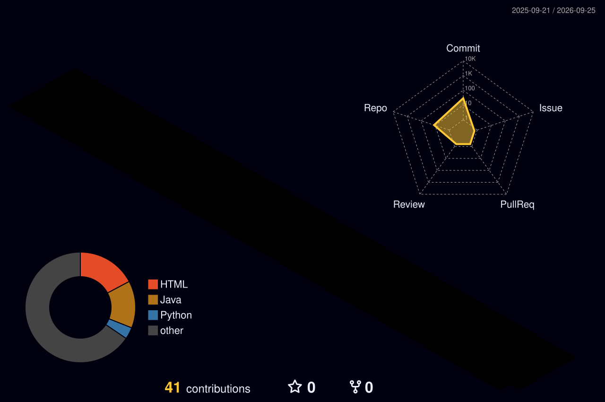

<!-- Tech stack strip -->

# 💫 About Me

<table>
<tr>
<td width="50%" valign="top">

## ⚡ Professional Snapshot

Name: Alamin Mondal

Role:
  - Java Full Stack Developer
  - AI/ML Project Developer
  - Data Analyst (Aspiring)

Location:
  - Mumbai, India 🇮🇳

Specialization:
  - Java Full Stack Development
  - Python Backend Engineering (FastAPI)
  - AI-Powered Healthcare Applications
  - REST API & Database Design

Community & Leadership:
  - Technical Lead, GDG on Campus AIKTC
  - Technical Member, Programmers Club
  - NSS & UNICEF Volunteer

Achievements:
  - 1st Runner-Up, Smart India Hackathon 2025 Grand Finale
  - 3rd Prize, Tech Sprint (GDG, 2026)

Currently:
  - Java Full Stack Developer Intern @ QSpiders

</td>

<td width="50%" valign="top">

## 🚀 Current Mission

### 🔭 Engineering Goals

* Building AI-powered healthcare applications
* Designing scalable REST APIs and backend services
* Turning raw data into structured, actionable insights
* Creating production-ready full-stack systems

### 🌱 Currently Learning

* Java, Spring, and JDBC (industry training @ QSpiders)
* Data Structures & Algorithms (interview prep)
* Power BI & advanced data visualization
* Cloud deployment on AWS

### 🤝 Open To

* Java Full Stack Developer Roles
* Software Engineer (Fresher) Roles
* Data Analyst Opportunities
* Open Source Collaborations

### 💡 Philosophy

> "Building technology that turns data and code into real-world impact."

</td>

</tr>
</table>

# 🏆 Recognition & Opportunities

<table>
<tr>

<td align="center" width="33%">

### 🧠 SIH 2025 Grand Finale

1st Runner-Up for an AI-powered multimodal clinical diagnostic system, out of thousands of teams nationwide.

</td>

<td align="center" width="33%">

### 🧑‍💻 GDG Technical Lead

Leading technical planning and delivery of workshops and hackathons on web, cloud, and open-source technologies.

</td>

<td align="center" width="33%">

### 💼 Open To Work

Actively exploring opportunities in:
Java Full Stack • AI/ML • Data Analytics

</td>

</tr>
</table>

# ⚡ GitHub Intelligence & Analytics

<table style="border-collapse: collapse;">
<tr>

<td align="center" style="padding: 5px;">

</td>

<td align="center" style="padding: 5px;">

</td>

</tr>
<tr>

<td align="center" style="padding: 5px;">

</td>

<td align="center" style="padding: 5px;">

</td>

</tr>
</table>

---

# 🐍 Contribution Ecosystem

---

# 🏅 GitHub Achievements

---

# 🧵 3D Contribution Visualization

# 📈 Social Proof Metrics

---

# 🛠 Tech Stack & Expertise

## 🎨 Frontend Development

---

## ⚙️ Backend Development

---

## 📱 Mobile Development

---

## 🤖 Artificial Intelligence / Machine Learning

 

---

## 📊 Data Science & Analytics

---

## 📊 Data Analytics & Visualization

---

## 🗄 Databases

---

## ☁️ Cloud & DevOps

---

## 🧰 Tools & IDEs

---

# ✍️ Daily Inspiration

---

# 🌐 Connect With Me

---

